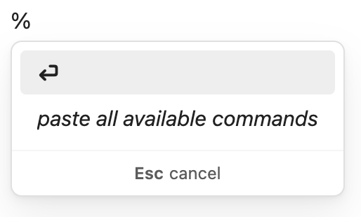
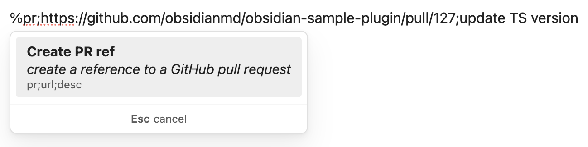
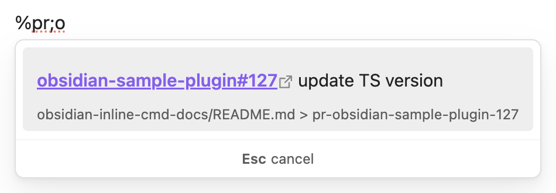
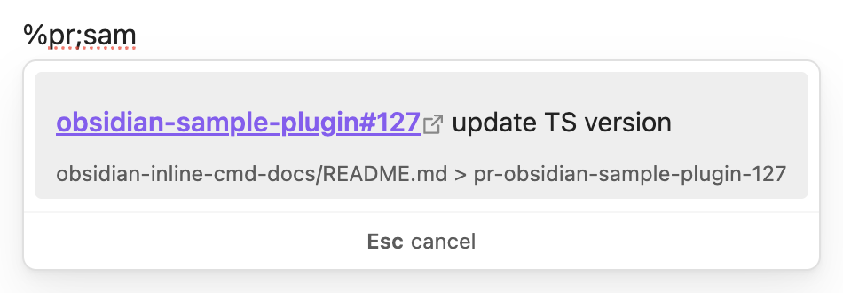
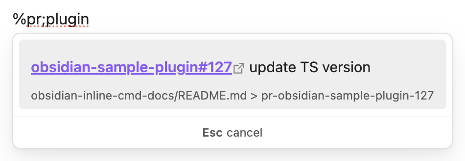
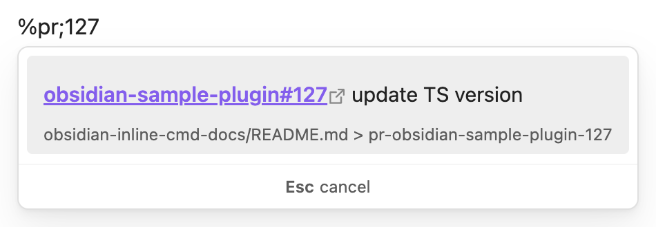

# Inline Commands

This is a plugin for Obsidian (https://obsidian.md) to insert text into your note by running commands inline.

# Usage

Type `%` anywhere in your note to activate a suggestion dropdown with available commands based on what you have typed. By default, the suggestions will be:
- **No-op command**: Keeps whatever you have typed after `%`
- **Paste all available commands:** Pastes a code block in your note to show what commands you can use



The default release comes with the following available commands (as output when paste all available commands is selected):

```
Syntax: cmd;arg1;arg2;...

unwrapped text is explicit
{} wraps placeholders
() wraps optional args

e;{block-id}
- embed any block into your note with a block ID

pr;{repo}-{pull-request-number}
- embed a reference to a GitHub pull request

pr;{url};({description})
- create a reference to a GitHub pull request

```

# Example: Creating and embedding a PR reference

Two of the default commands included with the plugin are to create and embed [block references](https://obsidian.md/help/links#Link+to+a+block+in+a+note) for GitHub pull requests anywhere in your notes. These two commands were the main motivation for me to create this plugin as they feel natural to how I take notes for myself. I wanted a way to quickly paste a URL in my daily note, have it automatically be prettified, and then be able to embed that reference in my later daily notes.

To create a reference to a pull request, I'd type the following into my note:

> %pr;https://github.com/obsidianmd/obsidian-sample-plugin/pull/127;update TS version

The plugin will show the corresponding suggestion:



When I press enter, the plugin will paste the output of the command directly into my note:

> \[\*\*obsidian-sample-plugin#127**]\(https://github.com/obsidianmd/obsidian-sample-plugin/pull/127) update TS version \^pr-obsidian-sample-plugin-127

Which renders as:

> [**obsidian-sample-plugin#127**](https://github.com/obsidianmd/obsidian-sample-plugin/pull/127) update TS version ^pr-obsidian-sample-plugin-127

Then, to embed that pull request reference into my note, I'd type:

> %pr;o

And it'll search my vault for PR references that include with `o`, display the markdown, and show the source of the block reference:

> 

Similarly, I could type `sam`, `plugin` or `127` and they'd all include the reference as a suggestion:

> 
> 
> 

When I select the suggestion, it'll insert the following markdown into my note:

!\[\[path-to-my-note/README.md#^pr-obsidian-sample-plugin-127|obsidian-sample-plugin#127]]

Which looks like:

> 

As I use the [Minimal theme](https://community.obsidian.md/themes/minimal) that allows me to paste clean embeds, my notes for any given PR look seamless across all my daily notes, but I only have to keep it updated in one place.

# Future versions

## Addressing feedback!

If people use this and have feedback, I'm happy to listen and potentially improve/update/change parts of the plugin.

## Customizable commands

I intend to create a friendly UX for users to create and maintain their own inline commands and shortcuts. It's not really a novel concept, notable examples are the default `Insert table` command and [natural language dates](https://publish.obsidian.md/hub/02+-+Community+Expansions/02.05+All+Community+Expansions/Plugins/nldates-obsidian). Using a deterministic `cmd;arg1;arg2;...` pattern makes this a bit more customizable for a variety of use cases, so I hope this will be of use for people with different note-taking needs and habits.

## Import/export commands

Along the same lines as above, I think it would be nice to be able to import and export commands so that the useful ones can be shared.

## New default commands

As running commands involves executing somewhat opaque backend code, I think keeping the plugin minimal is best and I don't plan to add new default commands.

# How to use

- Clone this repo.
- Make sure your NodeJS is at least v18 (`node --version`).
- `npm i` to install dependencies.
- `npm run dev` to start compilation in watch mode.

## Manually installing the plugin

- Clone this repo.
- Make sure your NodeJS is at least v18 (`node --version`).
- `npm i`.
- `npm run build`.
- Copy over `main.js`, `styles.css`, `manifest.json` to your vault `path-to-vault/.obsidian/plugins/your-plugin-id/`.
